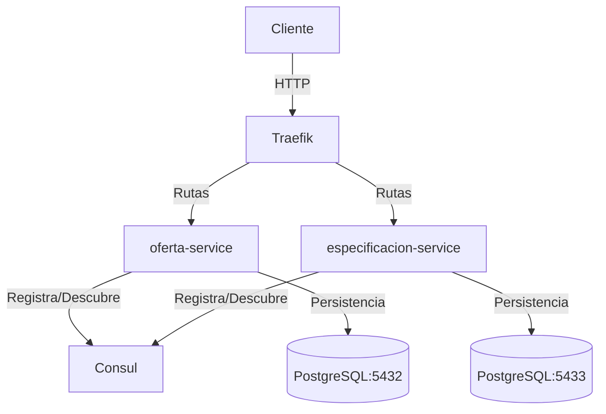

# Go Microservices con Traefik y Consul

Arquitectura de microservicios en Go con API Gateway (Traefik), Service Discovery (Consul) y PostgreSQL.

## 🏗️ Arquitectura

```
┌─────────────────────────────────────────────────────────────┐

```

## 🗃️ Inicialización de Datos

Cada servicio incluye un script SQL de inicialización ubicado en `[servicio]/scripts/init_db.sql` que realiza las siguientes acciones:

1. **Creación de tablas** con `IF NOT EXISTS` para evitar conflictos
2. Inserción de datos de prueba para desarrollo
3. Configuración de secuencias para evitar conflictos con IDs

### Integración con ORM (GORM)

La estructura de la base de datos está diseñada para funcionar perfectamente con GORM:

- **Campos estándar**: `id`, `created_at`, `updated_at`, `deleted_at`
- **Tipos de datos compatibles** con la mayoría de ORMs
- **Nombres de columnas** en formato snake_case
- **Relaciones** definidas de forma explícita

### Estructura de tablas

#### oferta-service
```sql
CREATE TABLE IF NOT EXISTS ofertas (
    id SERIAL PRIMARY KEY,
    created_at TIMESTAMP WITH TIME ZONE DEFAULT CURRENT_TIMESTAMP,
    updated_at TIMESTAMP WITH TIME ZONE DEFAULT CURRENT_TIMESTAMP,
    deleted_at TIMESTAMP WITH TIME ZONE,
    -- ... otros campos
);
```

#### especificacion-service
```sql
CREATE TABLE IF NOT EXISTS especificaciones (
    id SERIAL PRIMARY KEY,
    created_at TIMESTAMP WITH TIME ZONE DEFAULT CURRENT_TIMESTAMP,
    updated_at TIMESTAMP WITH TIME ZONE DEFAULT CURRENT_TIMESTAMP,
    deleted_at TIMESTAMP WITH TIME ZONE,
    oferta_id INTEGER NOT NULL,
    -- ... otros campos
);
```

Esta estructura garantiza que:
- No hay conflictos con las migraciones automáticas del ORM
- Los datos de prueba están disponibles inmediatamente
- La integración con GORM es transparente

## 🚀 Servicios

### 1. **oferta-service** (Puerto 8082)
Gestión de ofertas con CRUD completo.

### 2. **especificacion-service** (Puerto 8081)
Gestión de especificaciones con CRUD parcial según especificaciones de lo solicitado.

### 3. **Traefik** (Puerto 80) (puerto 8080 para revisar en el navegador)
API Gateway que enruta el tráfico a los microservicios.

### 4. **Consul** (Puerto 8500)
Service Discovery para registro y descubrimiento de servicios.

## 📋 Requisitos

- Docker
- Docker Compose
- Go 1.21+ (para desarrollo local)

## 🛠️ Instalación y Ejecución

### 1. Clonar el repositorio
```bash
git clone https://github.com/GustavoAuger/semana2.git
cd Go-Micro
```

### 2. Levantar todos los servicios
```bash
docker-compose up -d
```

### 3. Verificar que los servicios estén corriendo
```bash
docker-compose ps
```

### 4. Ver logs
```bash
# Ver logs de todos los servicios
docker-compose logs -f

# Ver logs de un servicio específico
docker-compose logs -f oferta-service
docker-compose logs -f especificacion-service
docker-compose logs -f traefik
```

## 🌐 Endpoints


#### Oferta Service
```bash
# Health check
curl http://localhost/api/v1/ofertas/health

# Listar todas las ofertas
curl http://localhost/api/v1/ofertas

# Obtener una oferta por ID
curl http://localhost/api/v1/ofertas/{id}
```
#### Especificacion Service
```bash
# Health check
curl http://localhost/api/v1/especificaciones/health

# Listar todas las especificaciones
curl http://localhost/api/v1/especificaciones

# Obtener una especificación por ID
curl http://localhost/api/v1/especificaciones/1

# Crear una nueva especificación
curl -X POST http://localhost/api/v1/especificaciones \
  -H "Content-Type: application/json" \
  -d '{
    "oferta_id": 1,
    "numero_vacantes": 2,
    "personal_a_cargo": 3,
    "tipo_contrato": "Indefinido",
    "modalidad_trabajo": "Híbrido",
    "categoria": "Desarrollo de Software",
    "subcategoria": "Backend",
    "sector": "Tecnología",
    "nivel_profesional": "Senior",
    "departamento": "Ingeniería",
    "experiencia_minima": "5 años",
    "jornada_laboral": "Completa",
    "formacion_minima": "Grado en Informática"
  }'

# Actualizar una especificación
curl -X PUT http://localhost/api/v1/especificaciones/1 \
  -H "Content-Type: application/json" \
  -d '{
    "oferta_id": 1,
    "numero_vacantes": 3,
    "personal_a_cargo": 5,
    "tipo_contrato": "Indefinido",
    "modalidad_trabajo": "Remoto",
    "categoria": "Desarrollo de Software",
    "subcategoria": "Full Stack",
    "sector": "Tecnología",
    "nivel_profesional": "Senior",
    "departamento": "Ingeniería",
    "experiencia_minima": "5 años",
    "jornada_laboral": "Completa",
    "formacion_minima": "Grado en Informática o equivalente"
  }'

# Eliminar una especificación
curl -X DELETE http://localhost/api/v1/especificaciones/1
```

### Acceso Directo a los Servicios (Solo para desarrollo)

**NOTA:** Los puertos directos (8081, 8082) están comentados en `docker-compose.yml` por seguridad. 

Para habilitar el acceso directo en desarrollo, descomenta las líneas de `ports` en el archivo `docker-compose.yml`:

```yaml
# oferta-service
ports:
  - "8082:8082"

# especificacion-service
ports:
  - "8081:8081"
```

Luego reinicia los servicios:
```bash
docker-compose down
docker-compose up -d
```

Y podrás acceder directamente:
```bash
# oferta-service (Puerto 8082)
curl http://localhost:8082/api/v1/health

# especificacion-service (Puerto 8081)
curl http://localhost:8081/api/v1/health
```

## 🎛️ Dashboards

### Traefik Dashboard
```
http://localhost:8080/dashboard/
```

### Consul UI
```
http://localhost:8500
```

## 🗄️ Base de Datos

### Cargar Datos Dummy

Para cargar datos de prueba en las bases de datos:

**En Windows (PowerShell):**
```powershell
.\load-dummy-data.ps1
```

**En Linux/Mac:**
```bash
chmod +x load-dummy-data.sh
./load-dummy-data.sh
```

Esto cargará:
- **10 ofertas** de ejemplo en diferentes áreas y países
- **10 especificaciones** correspondientes a cada oferta

### Conexión a PostgreSQL

#### Base de datos de ofertas
```bash
docker exec -it db_oferta psql -U postgres -d ofertas_db
```

#### Base de datos de especificaciones
```bash
docker exec -it db_especificacion psql -U postgres -d especificaciones_db
```

### Consultas útiles

```sql
-- Ver todas las ofertas
SELECT id, titulo, estado, pais FROM ofertas;

-- Ver todas las especificaciones
SELECT id, oferta_id, tipo_contrato, modalidad_trabajo FROM especificaciones;

-- Contar ofertas por estado
SELECT estado, COUNT(*) FROM ofertas GROUP BY estado;

-- Ver ofertas con sus especificaciones
SELECT o.titulo, e.tipo_contrato, e.modalidad_trabajo 
FROM ofertas o 
LEFT JOIN especificaciones e ON o.id = e.oferta_id;
```

## 🔧 Desarrollo

### Estructura del Proyecto

```
Go-Micro/
├── oferta-service/
│   ├── cmd/
│   │   └── server/
│   │       └── main.go
│   ├── internal/
│   │   ├── handler/
│   │   ├── service/
│   │   ├── repository/
│   │   ├── model/
│   │   └── consul/
│   ├── scripts/
│   │   └── init_db.sql
│   ├── Dockerfile
│   └── go.mod
├── especificacion-service/
│   ├── cmd/
│   │   └── server/
│   │       └── main.go
│   ├── internal/
│   │   ├── handler/
│   │   ├── service/
│   │   ├── repository/
│   │   ├── model/
│   │   └── consul/
│   ├── scripts/
│   │   └── init_db.sql
│   ├── Dockerfile
│   └── go.mod
├── docker-compose.yml
├── traefik.yml
├── dynamic_conf.yml
└── README.md
```

### Reconstruir un servicio específico

```bash
# Reconstruir oferta-service
docker-compose up -d --build oferta-service

# Reconstruir especificacion-service
docker-compose up -d --build especificacion-service
```

### Reiniciar un servicio

```bash
docker-compose restart oferta-service
docker-compose restart especificacion-service
```

## 🧹 Limpieza

### Detener todos los servicios
```bash
docker-compose down
```

### Detener y eliminar volúmenes (⚠️ Elimina los datos de la BD)
```bash
docker-compose down -v
```

### Limpiar imágenes y caché de Docker
```bash
docker system prune -a -f --volumes
```

## 🐛 Troubleshooting

### Ver logs de un servicio
```bash
docker logs oferta-service
docker logs especificacion-service
docker logs traefik
docker logs consul
```

### Verificar la red de Docker
```bash
docker network inspect go-micro_app-network
```

### Verificar servicios registrados en Consul
```bash
curl http://localhost:8500/v1/agent/services
```

### Verificar rutas en Traefik
```bash
curl http://localhost:8080/api/http/routers
```

## 📝 Variables de Entorno

### oferta-service
- `DB_HOST`: Host de la base de datos (default: `db_oferta`)
- `DB_PORT`: Puerto de la base de datos (default: `5432`)
- `DB_USER`: Usuario de la base de datos (default: `postgres`)
- `DB_PASSWORD`: Contraseña de la base de datos (default: `postgres`)
- `DB_NAME`: Nombre de la base de datos (default: `ofertas_db`)
- `CONSUL_HTTP_ADDR`: Dirección de Consul (default: `consul:8500`)
- `SERVICE_NAME`: Nombre del servicio (default: `oferta-service`)
- `SERVICE_PORT`: Puerto del servicio (default: `8082`)

### especificacion-service
- `DB_HOST`: Host de la base de datos (default: `db_especificacion`)
- `DB_PORT`: Puerto de la base de datos (default: `5432`)
- `DB_USER`: Usuario de la base de datos (default: `postgres`)
- `DB_PASSWORD`: Contraseña de la base de datos (default: `postgres`)
- `DB_NAME`: Nombre de la base de datos (default: `especificaciones_db`)
- `CONSUL_HTTP_ADDR`: Dirección de Consul (default: `consul:8500`)
- `SERVICE_NAME`: Nombre del servicio (default: `especificacion-service`)


### ✅ Implementado

- **Puertos protegidos**: Los puertos de los servicios (8081, 8082) están comentados por defecto. Todo el tráfico pasa por Traefik (puerto 80).
- **Red interna**: Los servicios solo son accesibles dentro de la red Docker `app-network`.
- **API Gateway**: Traefik actúa como punto único de entrada, facilitando la implementación de políticas de seguridad.

### 🔐 Recomendaciones adicionales para producción

- **HTTPS**: Configura certificados SSL/TLS en Traefik (Let's Encrypt)
- **Autenticación**: Implementa JWT o OAuth2 para autenticar usuarios
- **Rate Limiting**: Configura límites de peticiones en Traefik
- **Variables de entorno**: Usa secretos de Docker o variables de entorno seguras
- **Firewall**: Configura reglas de firewall para limitar el acceso
- **Monitoreo**: Implementa logging y monitoreo con Prometheus/Grafana
- **Actualizaciones**: Mantén las imágenes Docker actualizadas

## 📚 Tecnologías Utilizadas

- **Go 1.21+**: Lenguaje de programación
- **Gin**: Framework web para Go
- **PostgreSQL**: Base de datos relacional
- **Traefik v2.10**: API Gateway y reverse proxy
- **Consul 1.15**: Service Discovery
- **Docker & Docker Compose**: Containerización

## 👥 Autor

Gustavo Auger
